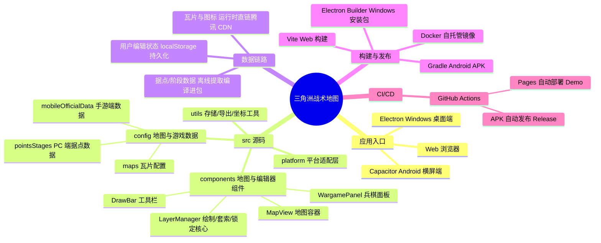

<div align="center">
  
  <h1>三角洲战术地图</h1>
  <p>面向《三角洲行动》全面战场的地图标注、兵棋推演与战术方案编辑工具。</p>
  <p>
    <a href="https://github.com/aeuicey/delta-force/actions/workflows/deploy.yml"></a>
    <a href="https://aeuicey.github.io/delta-force/"></a>
    <a href="https://github.com/aeuicey/delta-force/releases"></a>
  </p>
</div>

> 本项目是非官方社区工具，与腾讯、琳琅天上及《三角洲行动》官方无隶属或合作关系。

> **本仓库（aeuicey/delta-force）是开发分支**：新功能与修复先在此开发验证，再通过 Pull Request 提交到上游主仓库 [Deng0430/delta-force](https://github.com/Deng0430/delta-force)。稳定版本请以上游仓库为准。

## 项目简介

三角洲战术地图将地图信息、阶段据点、兵棋部署、行动路线和战术标注集中到一个工作台中，适用于战前规划、队伍分工、战术复盘和自定义模式配置。

项目支持浏览器、Windows 桌面端和 Android 横屏端，不依赖后端服务。编辑状态和战术方案默认保存在本地。


## 主要功能

- 支持 11 张全面战场地图，以及 PC 端和移动端游戏地图数据切换。
- 展示阶段、据点、防线、复活点、活动区域、地图道具和载具信息。
- 支持攻方与守方独立编辑和查看。
- 提供画笔、直线、箭头、防线、矩形、圆形、文字、套索和橡皮擦。
- 支持图形移动、缩放、旋转、顶点编辑、曲线调整和样式修改。
- 支持单兵、队伍、载具和建筑兵棋部署。
- 支持兵棋阵营、队伍、状态、协同关系及行动路线。
- 提供机动、进攻、侦察、迂回、撤退、护送、补给和固守等行动指令。
- 行动路线支持途经点、复制、反转、分支和执行成员设置。
- 支持保存战术方案，并导出为可独立打开的 HTML 战术板。
- 提供模式配置器，可编辑阶段、区域、据点、复活点、地图道具和载具规则。
- 内置攀升与烬区“胜者为王”模式数据。
- 正式版和编辑器支持复制、粘贴、撤回、恢复、多选和快捷删除。

## 0.0.2-indoor 更新摘要

### Android 端

- 新增局域网地图协作（Android 独占，主机一键开服，访客浏览器直达战术面板）：演示模式（只读跟随）与战术协作模式（双向同步）。
- 演示模式全权限锁定、横幅可关闭为状态光条、主机实时切换模式并广播、同步视角（访客平滑跟随主机地图视角）。
- 移动端访客自动切换触控操作逻辑并提示，竖屏访问给出横屏建议。
- 新增开屏视频（Android 独占，支持自定义 mp4 与可跳过设置，默认视频内置）。
- 新增高阶菜单（地图协作、开屏视频入口）。
- 应用版本号修正为 0.0.2-indoor（安装信息可见，可覆盖升级）。


### Web 端

- 新增分享模式（Web 独占）：生成随机后缀分享链接，主机/访客昵称与人数统计、战术命名、实时同步、访客只读、主机离线即刻过期。
- 分享需部署内置中继服务器（`npm run share:server` 或 Docker，见下文 Docker 部署）；GitHub Pages 上分享按钮置灰。


### 通用

- 新增绘图组件锁定：锁定后防移动/编辑/擦除，套索圈选含锁定图形时整组保护并提示。
- 支持鼠标中键拖动地图；修复选中框按钮缩放漂移、套索框缩放漂移、锁定图标尺寸不一致等问题。


<details>
<summary>0.0.1 更新摘要（点击展开）</summary>

- 完善地图图层、据点、防线和战术板导出。
- 扩展单兵、载具、建筑兵棋及行动指令功能。
- 增强防线、曲线、箭头和手绘路径编辑。
- 优化地图编辑器、快捷键和模式数据导入导出。
- 新增 PC/手游游戏地图数据切换。
- 新增 Android 横屏版本及触控适配。
- 修复箭头、输入、图层交互和拖动性能问题。

</details>

## 平台说明

### Web 与 Windows

支持鼠标、右键、滚轮和键盘快捷键，适合完整战术编辑和地图配置。

### Android

Android 版本固定横屏运行，支持沉浸式全屏、挖孔屏和圆角屏。兵棋、路线和绘制工具均已针对触控操作调整。

Android 应用界面保持中文，发布 APK 统一使用英文文件名：

```text
release/deltaforce-tactical-map-0.0.2-indoor-android-debug.apk
```

### 游戏数据

工具栏中的“游戏数据：PC端 / 移动端”表示《三角洲行动》游戏本身的地图数据版本，不表示当前应用运行在哪个平台。

Windows 和 Android 应用都可以自由查看 PC 游戏数据或手游数据。

## 快捷键

| 快捷键 | 功能 |
| --- | --- |
| `Ctrl+C` / `Ctrl+V` | 复制 / 粘贴 |
| `Ctrl+Z` / `Ctrl+Y` | 撤回 / 恢复 |
| `Ctrl+单击` | 增减选择 |
| `Shift+单击` | 列表连续选择 |
| `Backspace` | 删除选中内容 |

## 本地运行

环境要求：Node.js 20.19+ 或 22.12+，npm 10+。

```bash
npm install
npm run dev
```

浏览器访问：

```text
http://127.0.0.1:5173
```

Windows 用户也可以双击 `start-server.bat`。

## Electron 桌面端

先启动 Web 开发服务器，再启动 Electron：

```bash
npm run dev
npm run electron:dev
```

构建 Windows x64 安装包：

```bash
npm run build:win
```

## Android 构建

Android 构建需要 Java 21、Android Studio 和 Android SDK 36。

```powershell
npm run android:sync
cd android
.\gradlew.bat assembleDebug
```

使用 Android Studio 打开工程：

```bash
npm run android:open
```

## 在线 Demo 与自动发布

main 分支每次有新提交，GitHub Actions 会自动完成两件事：

- **Web Demo**：构建并部署到 GitHub Pages，直接访问 <https://aeuicey.github.io/delta-force/> 即可在线体验。
- **Android APK**：打包 debug 版 APK 并创建 Release（标签形如 `android-v0.0.1-b<构建号>`），在 [Releases](https://github.com/aeuicey/delta-force/releases) 页下载。

工作流见 `.github/workflows/deploy.yml`，运行状态见页首徽章。

## Docker 部署

仓库内置 Docker 打包方案（`Docker/` 目录），适合自托管部署（含分享模式中继）：

```bash
# 项目根目录构建镜像
docker build -f Docker/Dockerfile -t deltaforce-tactical-map:0.0.2-indoor .

# 运行（端口按需修改）
docker run -d -p 8080:8781 --name deltaforce-tactical-map deltaforce-tactical-map:0.0.2-indoor
# 访问 http://localhost:8080/
```

也可以进入 `Docker/` 目录使用 `docker compose up -d --build`。镜像为多阶段构建（Node 构建 + Node 中继服务器托管），静态站点与分享模式 API（`/api/share`，端口 8781）一体提供。详细说明见 [Docker/README.md](./Docker/README.md)。

## 项目结构



## 常用命令

| 命令 | 用途 |
| --- | --- |
| `npm run dev` | 启动 Web 开发服务器 |
| `npm run build` | 构建 Web 版本 |
| `npm run preview` | 预览生产构建 |
| `npm run electron:dev` | 启动 Electron 开发版 |
| `npm run build:win` | 构建 Windows 安装包 |
| `npm run android:sync` | 构建并同步 Android 工程 |
| `npm run android:open` | 使用 Android Studio 打开工程 |

## 数据存储

- Web 数据保存在浏览器本地存储中。
- Windows 桌面版数据保存在 Electron 用户数据目录中。
- 卸载程序默认保留用户数据，重新安装后可以继续使用已有方案。

## 技术栈

React、TypeScript、Vite、Leaflet、Electron、Capacitor Android。

## 版权与声明

项目中的游戏名称、地图瓦片、干员图像、载具图标及相关素材版权归各自权利方所有。本项目仅用于个人学习、战术研究与非商业交流，请勿用于商业用途或冒充官方产品。
