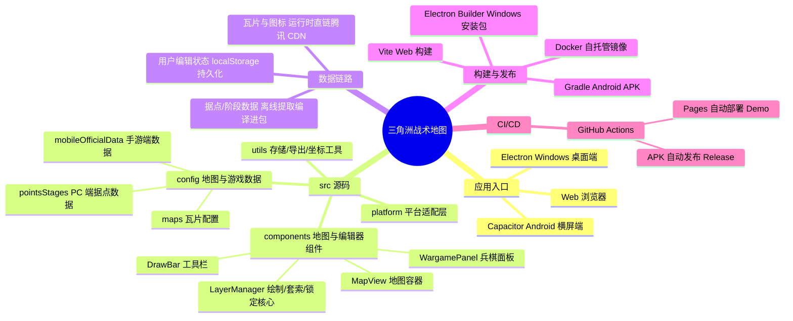

<div align="center">
  
  <h1>三角洲战术地图</h1>
  <p>面向《三角洲行动》全面战场的地图标注、兵棋推演与战术方案编辑工具。</p>
  <p>
    <a href="https://github.com/aeuicey/DeltaForce-TacticalPanel/actions/workflows/deploy.yml"></a>
    <a href="https://aeuicey.github.io/DeltaForce-TacticalPanel/"></a>
    <a href="https://github.com/aeuicey/DeltaForce-TacticalPanel/releases"></a>
    <a href="https://github.com/aeuicey/DeltaForce-TacticalPanel/pkgs/container/DeltaForce-TacticalPanel"></a>
  </p>
</div>

> 本项目是非官方社区工具，与腾讯、琳琅天上及《三角洲行动》官方无隶属或合作关系。

## 与上游仓库的关系

本仓库（[aeuicey/DeltaForce-TacticalPanel](https://github.com/aeuicey/DeltaForce-TacticalPanel)）是上游主仓库 [Deng0430/delta-force](https://github.com/Deng0430/delta-force) 的**开发分支（fork）**，双方保持双向同步：

- **本分支 → 上游**：新功能与修复先在本分支开发验证，再通过 Pull Request 回馈上游。已被上游采纳的改进包括：Android 导出修复（PR #1）、绘图组件锁定（PR #3，上游在其基础上重构进了正式版）、套索锁定保护（PR #4）。
- **上游 → 本分支**：上游正式版（当前 v0.1.1）的内容会合并回本分支。2026-08 已完成 v0.1.0 / v0.1.1 合并，本分支因此同时具备**上游全部正式功能**（刷新载具、分层兵棋、阶段/回合、部署备注、指南针、PC/移动端数据隔离等）与**本分支独占功能**（网页分享模式、Android 局域网协作、开屏视频、高阶菜单等）。

**合并后的功能改进一览**：

- 兵棋推演升级为分层指挥体系（阵地支援、干员技能、枪线、路线曲线），战术部署按阶段/回合独立存储并可复制。
- 新增地图指南针，绘制内容与地图元素随视角同步旋转。
- 战术板导出适配阶段/回合/备注等新内容，支持原生数据包导入导出与三种导出模式。
- 本分支独占的协作能力不受影响：局域网协作（演示/协作/同步视角）、网页分享模式、开屏视频与上游新功能共存可用。

稳定版本请以上游仓库为准；需要最新协作/分享功能请使用本分支的构建产物。

## 项目简介

三角洲战术地图将地图信息、阶段据点、兵棋部署、行动路线和战术标注集中到一个工作台中，适用于战前规划、队伍分工、战术复盘和自定义模式配置。

项目支持浏览器、Windows 桌面端和 Android 横屏端。正式版不依赖后端服务，编辑状态和战术方案默认保存在本地；本分支额外的分享与局域网协作功能需配合内置中继服务器或 Android 主机使用（见下文）。


## 主要功能

- 支持 11 张全面战场地图，以及 PC 端和移动端游戏地图数据切换。
- 展示阶段、据点、防线、复活点、活动区域、地图道具、部署载具和刷新载具。
- 支持攻方与守方独立查看，并按阶段、回合保存战术部署。
- 提供画笔、直线、箭头、防线、矩形、圆形、文字、套索和橡皮擦。
- 支持图形移动、缩放、旋转、顶点编辑、曲线调整、样式修改和绘图锁。
- 提供地图指南针，可旋转地图视角并让地图元素同步跟随。
- 支持单兵、队伍、载具和建筑兵棋，以及阵地支援和干员技能标注。
- 支持兵棋阵营、队伍、状态、协同关系、行动路线和枪线。
- 提供机动、进攻、侦察、迂回、撤退、护送、补给和固守等行动指令。
- 行动路线支持曲线、途经点、复制、反转、分支和执行成员设置。
- 支持 Markdown 部署备注、HTML 战术板和原生战术数据包导入导出。
- 提供模式配置器，可编辑阶段、区域、据点、复活点、地图道具和载具规则。
- 内置全部 11 张地图的胜者为王基础数据。
- 正式版和编辑器支持复制、粘贴、撤回、恢复、多选和快捷删除。
- 本分支新增：网页分享模式（实时协作）、Android 局域网协作与开屏视频、绘图组件锁定。

## 0.1.1 更新内容

- 完成 PC 游戏数据与移动端游戏数据的静态隔离。11 张攻防地图的阶段、据点、区域、复活点、地图道具和部署载具均使用各自数据对象；即使两端当前内容相同，修改 PC 配置也不会再连带改变手游数据。
- 修复移动端攻防模式部署载具缺失。烬区继续使用独立手游官方数据，其余 10 张地图固化独立移动端部署快照。
- 更新“攀升·胜者为王”载具刷新数据：A 点抢滩登陆新增 8 条冲锋舟及对应刷新位置、规则；旧版本地模式配置升级后会按 UID 自动补齐。
- 更新“堑壕战·胜者为王”区域数据，修正 A 点占领区以及 S1 至 S5 的防线和攻守活动区范围；旧版本地配置会按稳定 UID 自动迁移对应官方区域。
- 完善模式配置器数据交换：导入时可自动识别完整编辑配置备份与正式模式数据，单图正式数据会合并到对应模式；攻防数据按当前 PC/移动端分别导入，不再误覆盖另一数据端。
- 模式配置器的正式数据导出改为“当前模式 × 当前地图 × 当前游戏数据端”，便于单独交换和核对一张地图；完整项目配置仍可通过“备份编辑配置”保存。
- 统一正式版、模式配置器和胜者为王数据中的复活点身份，为复活点建立稳定唯一 ID；部署载具改为按复活点 ID 关联，不再依赖容易变化的显示名称和数组序号。旧配置会自动迁移并补齐可识别的官方载具。
- 战术部署改为按“游戏数据端 × 游戏模式 × 地图”完全隔离，阶段进度、回合部署、撤回/恢复和战术方案不会再在 PC/手游数据或攻防/胜者/自定义模式之间串用。
- 正式编辑会实时同步当前阶段与回合的数据桶，导出时会合并最新画面状态，不再需要先切换阶段才能导出刚完成的部署。原生战术包升级为 v2，并记录所属游戏数据端和模式，同时兼容旧版数据包。
- PC 端地图最小缩放调整为 0.5，并在低于原生瓦片层级时继续复用已有瓦片，避免缩小后出现空白地图。
- 提高 PC 端双击兵棋路线新增途经点的可靠性：即使第一次点击后出现的编辑手柄改变了命中目标，第二次点击仍可识别为同一路线。
- 优化 Android 图形编辑时的触摸归属和双指缩放同步，减少地图、图形与编辑手柄争抢手势造成的跳动或误触。

## 0.1.0 更新内容（上游正式版）

### 胜者为王与刷新载具

- 新增刷新载具功能，并完成除金字塔外全部地图的刷新载具适配。这是本版本的重点更新之一。
- 地图会标出载具刷新位置；详情面板会展示兵力、比赛时间、地图事件等刷新条件及对应载具信息。
- 刷新载具资料参考了哔哩哔哩作者整理的[《目前全网第一份三角洲大战场地图载刷新时间表（仅限胜者为王）》](https://www.bilibili.com/video/BV1DRE86QEqx/)，感谢原作者对相关数据的整理与分享。
- 新增堑壕、临界点和断轨的完整胜者为王适配，其他地图的当前进度见下方表格。
- 临界点的大事件不影响本轮已适配的刷新载具、据点及占领区、攻守活动区等内容。

### 分层兵棋推演

- 新增“阵地支援”，并允许干员在地图上部署和标注技能。
- 兵棋推演现可覆盖阵营指挥、步兵或载具指挥、小队长等不同指挥层级：既能规划全局阶段和支援资源，也能细化到小队路线、技能和火力方向。
- PC 端重构兵棋悬浮操作按钮，改善操作入口的辨识度和可用性。
- 兵棋路线新增曲线支持。
- 单兵、载具和建筑兵棋新增枪线，可通过鼠标滚轮调整指向和长度，更清楚地表达进攻、防守及警戒方向。

### 阶段与回合

- 战术部署改为按“阶段 / 回合”独立存储。同一阶段可以建立多个回合，用于保留不同战术方案，无需先删除原有部署。
- 支持复制回合，在现有方案基础上继续调整，减少重复绘制成本。
- 切换阶段后只显示当前阶段的战术部署，其他阶段数据继续保留；返回原阶段即可恢复查看。

### 部署备注

- 新增 Markdown 部署备注，可为当前战术方案补充行动说明、人员分工和注意事项。
- 支持富文本复制与导出，方便将内容转移到飞书等支持 Markdown 或富文本的协作平台。

### 导出、导入与分享

- 导出功能已适配阶段、回合、阵地支援、干员技能和部署备注等新增内容。
- 提供三种战术板导出模式：
  1. **当前阶段回合**：仅导出当前正在编辑的阶段与回合。
  2. **全部阶段**：包含全部阶段数据，但查看时一次只展示某个阶段的战术部署。
  3. **总览**：在整张地图上汇总展示所有阶段的部署，用于全局战术审阅。
- 新增项目原生数据包的导出与导入，使用本项目的用户可以直接传递并继续编辑战术方案。
- 导出功能新增移动端支持，感谢社区协作者 [@aeuicey](https://github.com/aeuicey) 提交相关支持。

### 地图指南针

- 新增地图旋转指南针，地图上的绘制内容和其他元素会随地图视角同步旋转。
- 支持输入具体旋转角度，也可以点击指南针左右两侧的旋转按钮，每次向左或向右旋转 15°。
- 点击 `N` 按钮可快速重置为正北方向；拖动指南针内部区域则可无级调整旋转角度。

### Android 与交互优化

- Android 端重构触控优先级并增加绘图锁，尽可能降低绘制、拖动、缩放和地图操作之间的误触。
- 感谢社区协作者 [@aeuicey](https://github.com/aeuicey) 对移动端触控与绘图交互提交的支持。

## 胜者为王适配进度

项目已固化全部 11 张地图的胜者为王基础数据，当前细节适配进度如下：

| 地图 | 部署载具 | 刷新载具 | 区域适配 |
| --- | --- | --- | --- |
| 攀升 | 攻：完成<br>防：完成 | 攻：完成<br>防：完成 | 攻：完成<br>防：完成 |
| 临界点 | 攻：完成<br>防：完成 | 攻：完成<br>防：完成 | 攻：完成<br>防：完成 |
| 断层 | 攻：AB 完成，C 无<br>防：AB 完成，C 无 | 攻：完成<br>防：完成 | 攻：未标注<br>防：未标注 |
| 断轨 | 攻：完成<br>防：完成 | 攻：完成<br>防：完成 | 攻：完成<br>防：完成 |
| 斗兽场 | 攻：AD 完成，B 中复活点，C 无<br>防：AB 完成 | 攻：完成<br>防：完成 | 攻：大事件<br>防：大事件 |
| 风暴眼 | 攻：E 复活点 1 适配缺失<br>防：完成 | 攻：完成<br>防：完成 | 攻：未标注<br>防：未标注（待确认） |
| 烬区 | 攻：完成<br>防：完成 | 攻：完成<br>防：完成 | 攻：修改<br>防：修改 |
| 金字塔 | 攻：未标注<br>防：未标注 | 攻：未标注<br>防：未标注 | 攻：未标注<br>防：未标注 |
| 堑壕 | 攻：完成<br>防：完成 | 攻：完成<br>防：完成 | 攻：完成<br>防：完成 |
| 运河 | 攻：完成<br>防：ABC 完成，D 无 | 攻：完成<br>防：完成 | 攻：大事件<br>防：大事件 |
| 余震 | 攻：ABCD1 完成，D2 无<br>防：ABD2 完成，CD1 无 | 攻：完成<br>防：完成 | 攻：完成<br>防：完成 |

说明：“完成”表示当前进度表中的对应项目已经核对；“未标注”表示原进度表为空，不直接等同于未适配；“大事件”和“修改”表示仍有专项内容需要处理。临界点涉及的大事件不影响刷新载具、据点及占领区、攻守活动区等当前适配内容，因此计为完整适配。

## 0.0.2-indoor 更新摘要（本分支开发版）

### Android 端

- 新增局域网地图协作（Android 独占，主机一键开服，访客浏览器直达战术面板）：演示模式（只读跟随）与战术协作模式（双向同步）。
- 演示模式全权限锁定、横幅可关闭为状态光条、主机实时切换模式并广播、同步视角（访客平滑跟随主机地图视角）。
- 移动端访客自动切换触控操作逻辑并提示，竖屏访问给出横屏建议。
- 新增开屏视频（Android 独占，支持自定义 mp4 与可跳过设置，默认视频内置）。
- 新增高阶菜单（地图协作、开屏视频入口）。
- 应用版本号修正为 0.0.2-indoor（安装信息可见，可覆盖升级）。


### Web 端

- 新增分享模式（Web 独占）：生成随机后缀分享链接（一键复制），主机/访客昵称与人数统计、战术命名、实时同步、访客只读、主机离线即刻过期（访客即时收到失效通知）。
- 网页端自动识别移动端访问，自动切换触控操作逻辑并提示。
- 分享需部署内置中继服务器（`npm run share:server` 或 Docker，见下文 Docker 部署）；GitHub Pages 上分享按钮置灰。


### 通用

- 新增绘图组件锁定：锁定后防移动/编辑/擦除，套索圈选含锁定图形时整组保护并提示。
- 支持鼠标中键拖动地图；修复选中框按钮缩放漂移、套索框缩放漂移、锁定图标尺寸不一致等问题。

<details>
<summary>0.0.1 更新摘要（点击展开）</summary>

- 完善地图图层、据点、防线和战术板导出。
- 扩展单兵、载具、建筑兵棋及行动指令功能。
- 增强防线、曲线、箭头和手绘路径编辑。
- 优化地图编辑器、快捷键和模式数据导入导出。
- 新增 PC/手游游戏地图数据切换。
- 新增 Android 横屏版本及触控适配。
- 修复箭头、输入、图层交互和拖动性能问题。

</details>

## 平台说明

### Web 与 Windows

支持鼠标、右键、滚轮和键盘快捷键，适合完整战术编辑和地图配置。

### Android

Android 版本固定横屏运行，支持沉浸式全屏、挖孔屏和圆角屏。兵棋、路线和绘制工具均已针对触控操作调整。

Android 应用界面保持中文，发布 APK 统一使用英文文件名：

```text
release/deltaforce-tactical-map-0.0.2-indoor-android-debug.apk
```

### 游戏数据

工具栏中的“游戏数据：PC端 / 移动端”表示《三角洲行动》游戏本身的地图数据版本，不表示当前应用运行在哪个平台。

Windows 和 Android 应用都可以自由查看 PC 游戏数据或手游数据。

## 快捷键

| 快捷键 | 功能 |
| --- | --- |
| `Ctrl+C` / `Ctrl+V` | 复制 / 粘贴 |
| `Ctrl+Z` / `Ctrl+Y` | 撤回 / 恢复 |
| `Ctrl+单击` | 增减选择 |
| `Shift+单击` | 列表连续选择 |
| `Backspace` | 删除选中内容 |

## 本地运行

环境要求：Node.js 20.19+ 或 22.12+，npm 10+。

```bash
npm install
npm run dev
```

浏览器访问 `http://127.0.0.1:5173`。Windows 用户也可以双击 `start-server.bat`。

Electron 开发模式：

```bash
npm run dev
npm run electron:dev
```

构建 Windows x64 安装包：

```bash
npm run build:win
```

### Android 构建

Android 构建需要 Java 21、Android Studio 和 Android SDK 36：

```powershell
npm run android:sync
cd android
.\gradlew.bat assembleDebug
```

使用 Android Studio 打开工程：

```bash
npm run android:open
```

## 在线 Demo 与自动发布

main 分支每次有新提交，GitHub Actions 自动完成：Pages 部署、Windows 安装包、Android APK、Docker 镜像四路构建（旧构建自动清理，每个渠道只保留最新版），运行状态见页首徽章。

### 三个版本的区别

| 版本 | 获取方式 | 说明 |
| --- | --- | --- |
| **纯静态版**（GitHub Pages / Windows 桌面端） | 浏览器访问 <https://aeuicey.github.io/DeltaForce-TacticalPanel/>；或 Releases 下载 `desktop-v*-b*` 的 `deltaforce-tactical-map-*-setup.exe` | 同一份构建产物：打开即用、无需服务器。桌面端为 Electron 壳（内置静态服务器），支持离线使用与本地数据保存。**不含**分享模式（无中继服务器） |
| **网页版**（完整功能，需服务器） | `npm run share:server` 本地启动，或 Docker 一键部署（见下文） | 在纯静态版基础上多出**分享模式**（随机链接、访客昵称统计、实时同步、过期失效），功能最完整 |
| **手机版**（Android APK） | Releases 下载 `android-v*-b*` 的 APK | 固定横屏触控优化，独占**局域网协作**（演示/协作双模式、同步视角）与**开屏视频** |

> 三个版本共享同一套代码与战术数据格式，战术方案可互通导出。

## Docker 部署

本仓库通过 GitHub Actions 在每次提交后自动构建 Docker 镜像并推送到在线镜像仓库 **GHCR**（GitHub Container Registry），无需自己构建。

### 在线镜像仓库一键部署（推荐）

远程计算机只需安装 Docker，**不用克隆仓库、不用装 Node**，一行命令完成部署：

```bash
curl -fsSL https://raw.githubusercontent.com/aeuicey/DeltaForce-TacticalPanel/main/Docker/deploy.sh | bash
# 完成后访问 http://<远程机器IP>:8080/
```

脚本会自动拉取最新镜像、清理旧容器并以 `8080 → 8781` 端口启动服务（含分享模式中继）。自定义端口：

```bash
curl -fsSL https://raw.githubusercontent.com/aeuicey/DeltaForce-TacticalPanel/main/Docker/deploy.sh | PORT=9000 bash
```

也可以不用脚本，直接一条 `docker run`：

```bash
docker run -d --name deltaforce-tactical-map --restart unless-stopped \
  -p 8080:8781 ghcr.io/aeuicey/deltaforce-tacticalpanel:latest
```

**可用镜像标签**（`ghcr.io/aeuicey/deltaforce-tacticalpanel`）：

| 标签 | 说明 |
| --- | --- |
| `latest` | 最新构建（默认） |
| `0.0.2-indoor` | 版本号标签（随版本更新） |
| `sha-<commit>` | 指定某次提交的构建 |

**更新到最新版**：重新运行一键部署脚本即可（自动拉新镜像并替换容器）。

### 手动构建

```bash
# 项目根目录构建镜像
docker build -f Docker/Dockerfile -t deltaforce-tactical-map:0.0.2-indoor .

# 运行（端口按需修改）
docker run -d -p 8080:8781 --name deltaforce-tactical-map deltaforce-tactical-map:0.0.2-indoor
# 访问 http://localhost:8080/
```

也可以进入 `Docker/` 目录使用 `docker compose up -d --build`。镜像为多阶段构建（Node 构建 + Node 中继服务器托管），静态站点与分享模式 API（`/api/share`，端口 8781）一体提供。详细说明见 [Docker/README.md](./Docker/README.md)。

## 项目结构



## 常用命令

| 命令 | 用途 |
| --- | --- |
| `npm run dev` | 启动 Web 开发服务器 |
| `npm run build` | 构建 Web 版本 |
| `npm run preview` | 预览生产构建 |
| `npm run share:server` | 启动分享模式中继服务器 |
| `npm run electron:dev` | 启动 Electron 开发版 |
| `npm run build:win` | 构建 Windows 安装包 |
| `npm run android:sync` | 构建并同步 Android 工程 |
| `npm run android:open` | 使用 Android Studio 打开工程 |

### 数据存储

- Web 数据保存在浏览器本地存储中。
- Windows 桌面版数据保存在 Electron 用户数据目录中。
- 卸载程序默认保留用户数据，重新安装后可以继续使用已有方案。

## 社区衍生版本

感谢 [@aeuicey](https://github.com/aeuicey) 基于上游项目开发联网协作版本（即本仓库）：

- 项目地址：[aeuicey/DeltaForce-TacticalPanel](https://github.com/aeuicey/DeltaForce-TacticalPanel)
- 开发方向：多人联网协作与在线战术编辑。
- 当前状态：测试中。

## 技术栈

React、TypeScript、Vite、Leaflet、Electron、Capacitor Android。

## 版权与声明

本项目原创源代码采用 [MIT License](./LICENSE) 发布。

项目中的游戏名称、地图瓦片、干员图像、载具图标及其他第三方素材不属于 MIT 授权范围，相关权利归各自权利方所有。本项目不代表或冒充官方产品。
